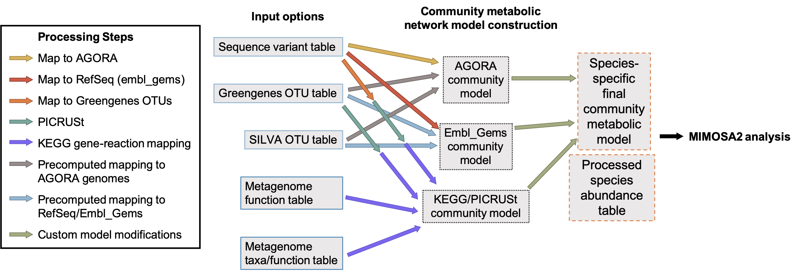
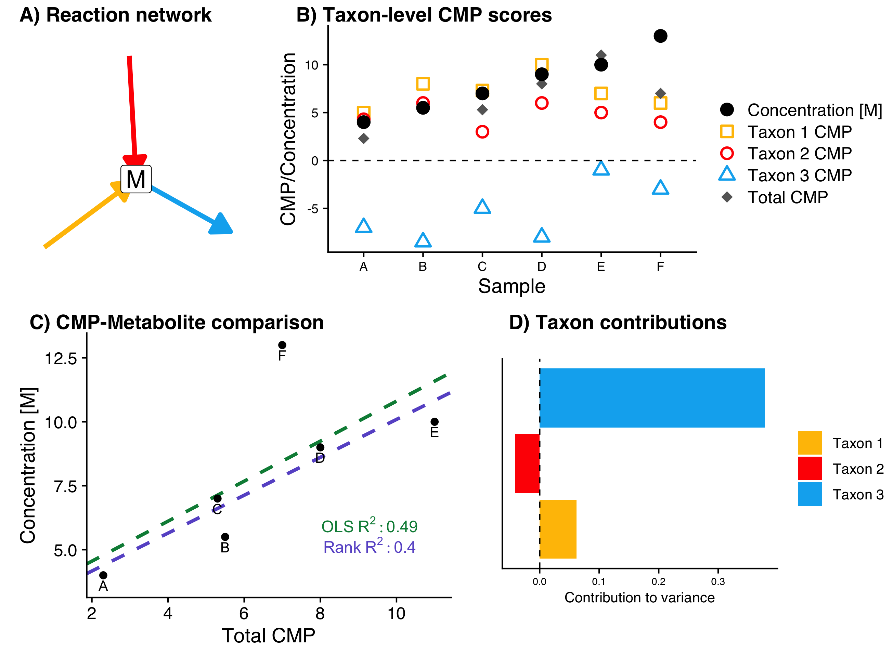

# What does MIMOSA2 do?

MIMOSA2 summarizes paired microbiome-metabolome datasets to support mechanistic interpretation and hypothesis generation. It answers 2 main questions:

**1) Do the metabolite levels in my dataset vary consistently with what we would expect from what is known about the capabilities of the associated microbiomes? Which metabolites appear to be microbiome-governed?**

**2) Which specific microbial taxa appear to be responsible for differences in the amounts of each metabolite across samples?**

MIMOSA2 uses a 4-step workflow, described below, to answer these questions. A more technical explanation of the method can be found in the [MIMOSA2 manuscript](https://www.biorxiv.org/content/10.1101/2021.09.14.459910v1).

---
**1) Construct a community metabolic model consisting of the set of metabolic reactions that each community member taxon is predicted to be capable of performing.**

MIMOSA2 can map various types of microbiome data to various types of reference data (from either KEGG or collections of genome-scale metabolic reconstructions) to link microbiome taxa to metabolic reactions. The various options are illustrated in the flow
chart below. Note that when 16S rRNA ASVs are provided, the sequences are first mapped to an rRNA sequence database with vsearch and then linked to metabolic models based on the database mapping. The final product of this step is a table consisting of a set of metabolic reactions predicted to be linked to each taxon in the microbiome dataset.

---

Steps 2, 3, and 4 are shown below for a single toy example metabolite M, which is produced by Taxa 1 and 2 and utilized by Taxon 3. In this six-sample dataset, shifts in the amount of uptake by 
Taxon 3 can explain the largest share of the observed variance.

---
**2) Use the metabolic model to calculate metabolic potential (MP) scores for each taxon and metabolite, 
describing an approximate relative estimate of the effects of each taxon, on each metabolite, in each sample.**

MIMOSA2's metabolic potential scores are a normalized linear combination of the abundances of genes or reactions predicted to produce a metabolite minus those predicted to utilize it. These scores are calculated using the metabolic model and the taxa abundance data, 
for each metabolite and each taxon in each sample. MIMOSA2 also records and reports the particular synthesis or utilization reactions that formed the basis of the metabolic potential scores for each taxon.

---
**3) Compare total community-level metabolic potential (CMP) scores with metabolite measurements across all samples, 
and use a regression model to assess whether CMP scores are significantly predictive of metabolite levels.**

MIMOSA2 compares community metabolic potential scores (CMP, the sum of metabolic potential scores across all taxa for a metabolite) with the measurements of that metabolite, using a 
regression model to test whether CMP scores are significantly predictive of variation in metabolite levels. Metabolites with a significant positive association between CMP scores and metabolite levels are considered *putatively microbiome-governed*.

---
**4) Decompose the overall model fit from step 3 into the contributions from each taxon, 
identifying specific taxa that explain variation in each metabolite.**

Finally, MIMOSA2 analyzes the model fits from step 3 to calculate the amount of variation in a metabolite explained by CMP scores that is attributable to each contributing taxon. The sum of the contributions of all taxa is equal to the unadjusted R-squared of the 
regression model from step 3. In other words, a microbe's contribution to a metabolite is equal to the share of the total variation in that metabolite that is explained by that microbe's metabolic potential. For metabolites that are putatively microbiome-governed, the taxa with the largest contributions 
are hypothesized to be the main drivers of differences in the levels of that metabolite across samples. These contributions can be either positive (a taxon increases the variability of a metabolite) or negative (a taxon mitigates the variability). See the [FAQ](faqs.html) for more on the interpretation of contribution values, and [the manuscript](https://www.biorxiv.org/content/10.1101/2021.09.14.459910v1) for more details on how these 
contributions are calculated. 

<!-- # Terminology -->
