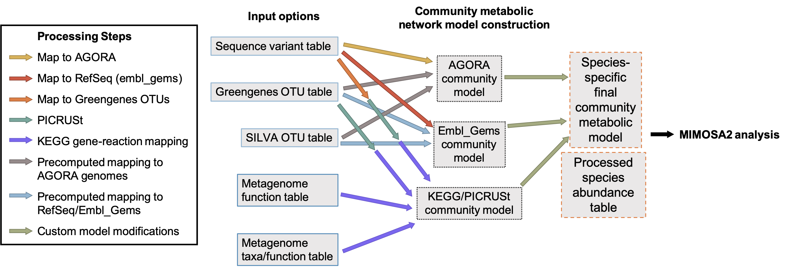

# Using the mimosa2 R package

The easiest way to run a MIMOSA2 analysis is via the web application. However, you can also install the mimosa2 R package
 to run your own custom analyses and integrate MIMOSA2 into your analysis pipelines.

## Installation

mimosa2 can be easily installed from GitHub using the `devtools` package:

```R
devtools::install_github("borenstein-lab/mimosa2", dependencies = T)
``` 
If you want to analyze ASV data, you will also need to have the program *vsearch* installed. Visit the [vsearch website](https://github.com/torognes/vsearch) to download and install.

## Generating or downloading preprocessed reference data

Before running a MIMOSA2 analysis, the reference data you would like to use for the analysis needs to be downloaded and/or generated. MIMOSA2 relies on two separate types of reference data: 

1) Reference data to link ASVs to reference taxa (not necessary if you have metagenomic KO annotation data)
2) Gene and reaction sets for reference taxa

The figure below illustrates all the possible combinations of input and reference data formats. You can set up all of them or just a subset for your analysis.



Several of these are available from the [Downloads](download.html) page. These can also be regenerated using scripts provided in the [MIMOSA2 GitHub repository](https://github.com/cnoecker/MIMOSA2shiny/). More info on doing so is provided below in the [Regenerating Processed Reference Data section](package.html#processRefs)

## Run a full MIMOSA2 analysis

Once you have downloaded and set up the relevant reference databases, you can run a full MIMOSA2 analysis simply by providing a "configuration table" containing all of the relevant settings for the analysis to the `run_mimosa2` function.
The table below lists the various fields that you can provide in your configuration table. Required fields are in bold.

| Field | Description | Possible values |
|------|----------|---------|
|**file1** | Microbiome file path | Valid file path|
|**file2** | Metabolomics file path | Valid file path|
|**database_choices_** | Taxonomic abundance file type| One of: "Sequence variants (ASVs)", "Greengenes 13_5 or 13_8 OTUs", "SILVA 132 OTUs", "Metagenome: Total KO abundances", "Metagenome: Taxon-stratified KO abundances (HUMAnN2 or PICRUSt/PICRUSt2)" |
|**source_choices** | Ref model option | One of: "PICRUSt KO genomes and KEGG metabolic model", "AGORA genomes and models", "RefSeq/EMBL_GEMs genomes and models" |
|simThreshold | If 16S rRNA ASVs are provided, threshold for mapping them to a reference database | Value from 0 to 1 (default 0.99)|
|netAdd | File path to network modifications file | Valid file path|
|met_type | Whether metabolite data is provided as KEGG compound IDs or metabolite names | T or F |
|met_transform | Whether a log transform should be applied to metabolite data| T or F |
|rankBased | Whether to use rank-based regression for comparing CMP scores and metabolites| T or F |
|**kegg_prefix** | File path to processed generic KEGG network - product of the generate_preprocessed_networks function above database files| Valid file path|
|**data_prefix** | File path to other reference databases | Valid file path|
|vsearch_path | File path to vsearch executable | Valid path|

Notes: 
- **kegg_prefix** is only required when using KEGG-based models.

Some example configuration tables:

- [An ASV-based analysis using EMBL_GEMS models and rank-based regression](link) 
- [A metagenome-based analysis using KEGG and OLS regression](link2)

You can also download the contribution table used to run any analysis on the MIMOSA2 web server, which allows anyone to later reproduce the same analysis in an R session.

Once you have downloaded the necessary reference data, installed MIMOSA2 and vsearch, and created a configuration table, it is easy to run a full MIMOSA2 analysis. Save it as a text document, for example "configuration_table1.txt", and run the following in an R session or script: 

```R
mimosa_results = run_mimosa2("configuration_table1.txt")
```

The run_mimosa2 function returns a list of data tables that is identical to the set of results provided by the web application. More details about the results are provided on the [Results](results.html) page.

If you want to generate plots of metabolic potential and taxonomic contributors for each metabolite, similar to the web app, use the `make_plots` and `with_plots` arguments for run_mimosa2:

```R
mimosa_results_make_plots = run_mimosa2("configuration_table1.txt", make_plots = T, save_plots = T)
```

In this case lists of plots will also be returned. If `save_plots` is true, the function will save all plots in a folder named "mimosa2results", which it will create in its current working directory.

## Run individual components of a MIMOSA2 analysis

## Other utility functions

- `format_humann2_contributions`

- `map_to_kegg`

- plot functions

<h4 id="processRefs">Processing Reference Data for Compatibility with MIMOSA2</h4>

Just document the process here, raw scripts ok
- Seq DBs: scripts
You can also generate your own version of the AGORA or RefSeq databases using the package function `download_ribosomal_ref_seqs`, which uses the [biomartR](https://ropensci.github.io/biomartr/) package to download the relevant list of accessions from NCBI. 

- OTU-DB mapping files

- OTU-specific KEGG models


#### Download and reformat metabolic reconstructions
To do so, the first step is to download the reference dataset you would like to use from the appropriate source. The source database options are:

- [AGORA](link)
- [embl_gems](link)
- PICRUSt_KEGG ([PICRUSt1 pre-calculated files], plus KEGG FTP downloads): KEGG network with GreenGenes OTUs and PICRUSt 1
- KEGG (KEGG FTP downloads): KEGG network without taxonomic information, to use with KEGG-annotated metagenomic data

Note that downloading the necessary KEGG FTP files requires a license. 

If you use AGORA 1.0.2 and the current (2019) version of embl_gems, information on each model is included in the package data. Otherwise, if you use a different database version,
you may need to create a new model info file, listing each model, its 16S copy number (if known), and an ID that is shared between the model itself and its linked sequence data. You can see an example for AGORA [here](link, put data up). 

Next, use the `generate_preprocessed_networks` function to reformat the model files to be compatible with MIMOSA2. For example, to format the *embl_gems* database models:

```R
generate_preprocessed_networks("embl_gems", dat_path = file_path_to_raw_models, out_path = file_path_for_output)
```

(In the function call above, you would replace `file_path_to_raw_models` and `file_path_for_output` with your corresponding file paths.) 

To use GreenGenes and KEGG, you can simply download the [GreenGenes representative OTU sequence files](http://greengenes.secondgenome.com/?prefix=downloads/greengenes_database/gg_13_5/).


