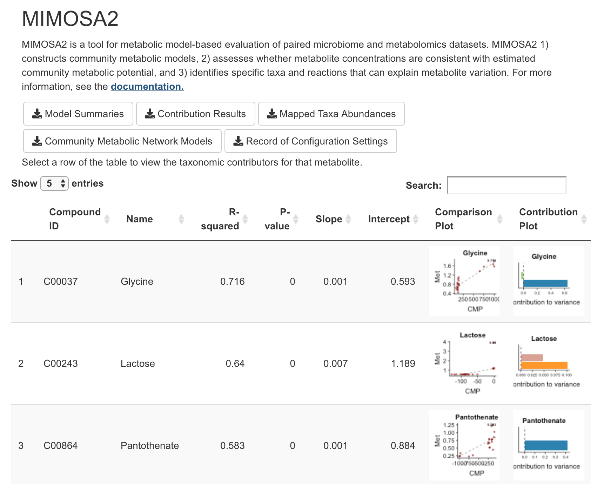

# Results of a MIMOSA2 Analysis

After running a MIMOSA2 analysis, the web application will provide several results files for download and will also generate summaries of the results.

## Results Tables for Download

The following files are produced by MIMOSA2 and can be downloaded from the web app by clicking the Download buttons at the top of the screen: 

- Model Summaries: A table describing the fit between metabolic potential scores and metabolite measurements for each compound. Includes the model coefficients, significance based on a drop-in-deviance test, and R-squared value.

- Contribution Results: A table describing the contribution of each taxon to the overall model fit for each metabolite. In other words, the fraction of the variation in each metabolite explained by this taxon, according to the
overall community model. *Note:* For analyses using rank-based regression, in order to reduce computation time, MIMOSA2 will only calculate taxonomic contributors for metabolites with a model p-value less than 0.1.

- Mapped Taxa Abundances: The processed taxa abundances, after mapping to the selected reference database -- for PICRUSt and KEGG, these are Greengenes OTUs; for AGORA and RefSeq, these are counts assigned to each reference genome.

- Community Metabolic Network Models: The set of reactions used to calculate metabolic potential for that analysis. Only reactions involving compounds in the metabolomics data are included.

- Record of Configuration Settings: A table listing the settings used for the analysis; can be used to reproduce the same workflow using the mimosa2 package.

## Output Interactive Table

Below the download buttons, the main panel of the web application displays an interactive table of results for each metabolite. This table includes the model fit results, 
number of taxa that explained greater than 5% of the variation, the specific reactions that contributed to model CMP scores, and plots of the overall fit and the 
contributors. Metabolites are ordered by the variance explained by the model and by the direction of the relationship (positive slopes first, then negative). The
first rows of the table therefore represent those metabolites whose variation is most consistent with shifts in the metabolic capacities of the community. 

Two types of plots are generated for each metabolite: 

- A scatter plot showing the overall relationship between community-level metabolic potential scores and metabolite measurements. The model fit is included as a trend line.
- A bar plot showing the major taxonomic contributors to variation for each metabolite. 

You can filter the table by any column (e.g. to see all metabolites with a model p-value less than a particular cutoff, or to search for a particular compound or taxon).

Below the interactive table, there are some additional buttons for downloading plots of the results. You can download these by selecting one or more rows and 
then clicking one of the "Download plot" buttons, which will only save the plots for the selected metabolites. The "Generate and download contribution heatmap" will download a summary plot 
of all of the taxonomic contributors for the selected metabolites (example below).

