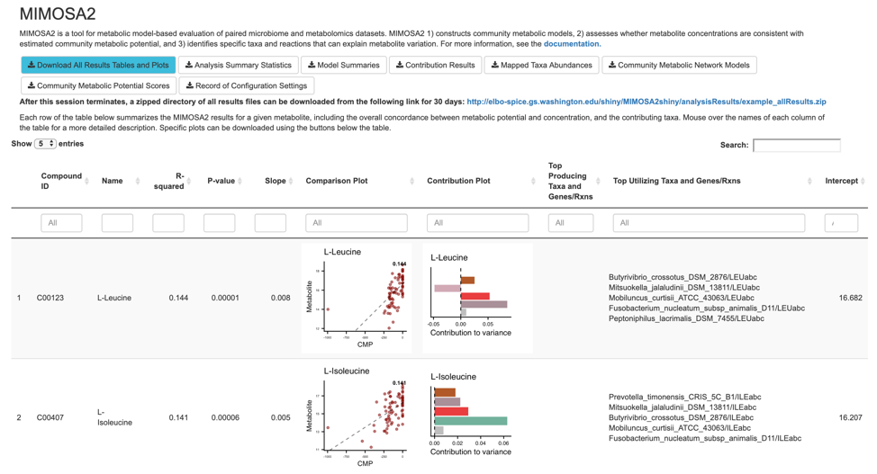
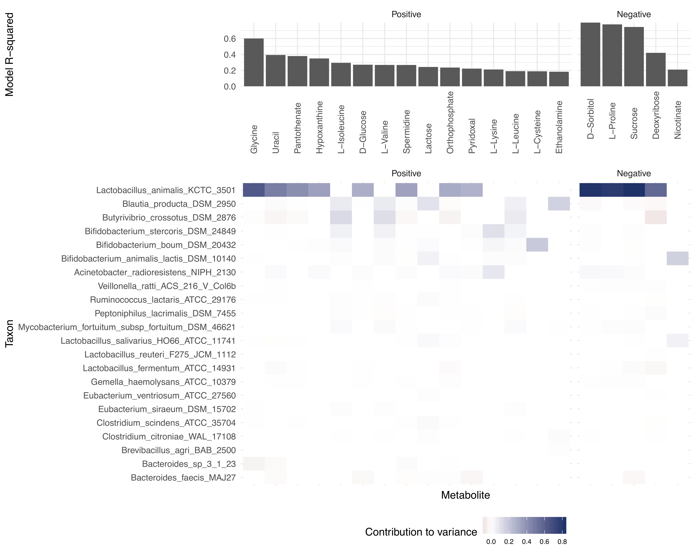

# Results of a MIMOSA2 Analysis

After running a MIMOSA2 analysis, the web application will provide several results files for download and will also generate summaries of the results.

## Results Tables for Download

You can download all results and plots produced by the analysis using the blue "Download All" button. The following specific files are produced by MIMOSA2 and can also be downloaded from the web app individually: 

- **Analysis Summary Statistics:** High-level summary statistics on the analysis results. The specific reported statistics are described in the table below:

| Field | Description |
|------|----------|
|Sample size with complete data | Number of samples with both microbiome and metabolomics data  |
|Original number of taxa | Number of taxa (or KOs, for metagenomic data) in the original dataset |
|Number of mapped taxa | Number of taxa (or KOs, for metagenomic data) in the complete community metabolic model constructed from the chosen reference database |
|Original number of metabolites | Number of metabolites in the provided dataset |
|Number of metabolites in network model | Number of metabolites in the provided dataset that were present in the community model |
|Number of metabolites with CMP scores | Number of metabolites in the provided dataset with varying CMP scores (a metabolite may be in the model but not have any varying CMP scores if all of its linked reactions are fully reversible) |
|Number of metabolites with successful model fits | Number of metabolites for which a regression solution was found. |
Number of significant (p <0.1) metabolites with positive model slope | Number of metabolites with a significant CMP-metabolite model in the expected direction. |
|Number of significant (p <0.1) metabolites | Number of metabolites with a significant CMP-metabolite model (positive or negative). |
|Number of metabolites with analyzed taxa contributors | Number of metabolites whose taxonomic contributors were analyzed (typically all metabolites with a model p < 0.1) |
|Number of contributing taxa | Number of taxa with nonzero contributions to variation in any metabolite. |

- **Model Summaries:** A table describing the fit between metabolic potential scores and metabolite measurements for each compound. Includes the model coefficients, significance based on a drop-in-deviance test, and R-squared value. It also includes metabolite-level summaries of the number of predicted synthesizing and degrading genes or reactions, and the top linked taxa and genes/reactions.

- **Contribution Results:** A table describing the contribution of each taxon to the overall model fit for each metabolite. This is labeled the "VarShare" column and represents the fraction of the variation in each metabolite explained by the taxon in question, according to the
overall community model. Contribution results are only included for metabolites with a model p-value less than 0.1. This file also includes information on contributing reactions for each taxon-metabolite pair.

- **Mapped Taxa Abundances:** The processed taxa abundances, after mapping to the selected reference database -- for PICRUSt and KEGG, these are Greengenes OTUs; for AGORA and RefSeq, these are counts assigned to each reference genome. For metagenomic data this is simply the provided KO table.

- **Community Metabolic Network Models:** The set of reactions used to calculate metabolic potential for that analysis. Only reactions involving compounds in the metabolomics data are included.

- **Community Metabolic Potential Scores:** The full database of taxon-specific community metabolic potential scores across samples.

- **Record of Configuration Settings:** A table listing the settings used for the analysis; can be used to reproduce the same workflow using the mimosa2 package.

## Output Interactive Table

Below the download buttons, the main panel of the web application displays an interactive table of results, with each row containing results for a single metabolite. The table contains the following columns: 

- *Compound ID*: KEGG compound ID for that metabolite
- *Name*: Metabolite name
- *R-squared*: Model R-squared
- *P-value*: Model significance (drop-in-deviance test)
- *Slope*: Slope of model
- *Comparison plot*: A scatter plot showing the overall relationship between community-level metabolic potential scores and metabolite measurements. The model fit is included as a trend line.
- *Contribution plot* (if applicable): A bar plot showing the major taxonomic contributors to variation for each metabolite. 
- *Top Producing Taxa and Genes/Rxns*: The taxa with the largest contributors to variation in that metabolite, and the genes or reactions producing that metabolite that contributed to the relevant CMP scores. A maximum of 5 taxa-gene/reaction pairs is shown, but all of them can be found in the Contribution Results file. 
- *Top Utilizing Taxa and Genes/Rxns*: The taxa with the largest contributors to variation in that metabolite, and the genes or reactions utilizing that metabolite that contributed to the relevant CMP scores. A maximum of 5 taxa-gene/reaction pairs is shown, but all of them can be found in the Contribution Results file.
- *Intercept*: Model intercept (provided for completeness, but is not very interpretable.)

For AGORA and embl_gems models, reaction annotations can be obtained from [http://bigg.ucsd.edu](http://bigg.ucsd.edu). For KEGG models, KO annotations can be found at [http://www.genome.jp/kegg/ko.html](http://www.genome.jp/kegg/ko.html). 

Metabolites are ordered by the variance explained by the model and by the direction of the relationship. The
first rows of the table therefore represent those metabolites whose variation is most consistent with shifts in the metabolic capacities of the community. You can 
also sort and filter the table by any column - e.g. to see all metabolites with a model p-value less than a particular cutoff, or to search for a particular compound or taxon.

Below the interactive table, there are additional buttons for downloading plots for specific metabolites. To use these, click rows of the table to select metabolites of interest, 
and then press the button to download the relevant type of plot for the selected metabolites. The "Generate and download contribution heatmap" will download a summary plot 
of all of the taxonomic contributors for the subset of metabolites that you have selected (example below).

